# Senior_Project
Asset management device developed for B.S. in Electronic Engineering Technology senior project at DeVry University.

## Concept 
Create a asset management system that was portable and adaptable to the users needs. Built around the [ThingMagic Nano](http://www.thingmagic.com/index.php/embedded-rfid-readers/thingmagic-nano-module) the [SparkFun Simultaneous RFID Reader](https://www.sparkfun.com/products/14066) would be able to work with any Gen2 RFID tag. It also provides serial breakout pins for computer interface, that will allow reading and writing of tags using [Universal Reader Assistant Program](http://www.thingmagic.com/index.php/manuals-firmware#Universal_Reader_Assistant). Using an Arduino and touchscreen, the user will be allowed to directly read nearby tags, save the data, and make a comparison to currently present tags.

## Hardware
For the portable device, major components include the RFID Reader, an Arduino, and a touch screen. Other components include a battery, external antenna, serial breakout board, PCB board.

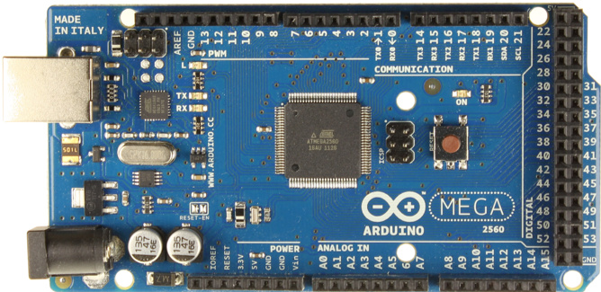
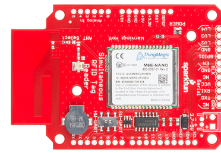

### Wiring
Below are wiring diagrams for the major components of the device and each individual module's pin assignment. Not included are the external antenna and serial breakout board. The voltage divider circuit from the battery to the Arduino that allows usable input for battery monitoring is also not included.

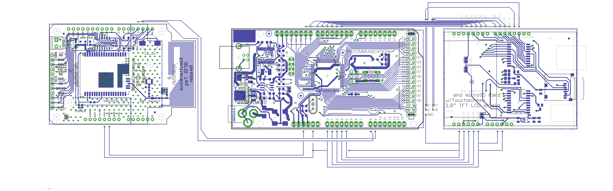

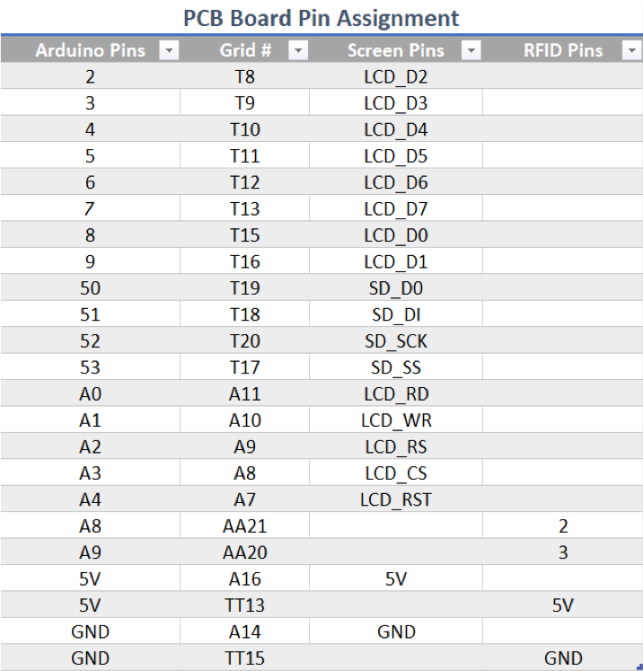

## Software

The programming concept was based on the following Use Case and State Diagrams:

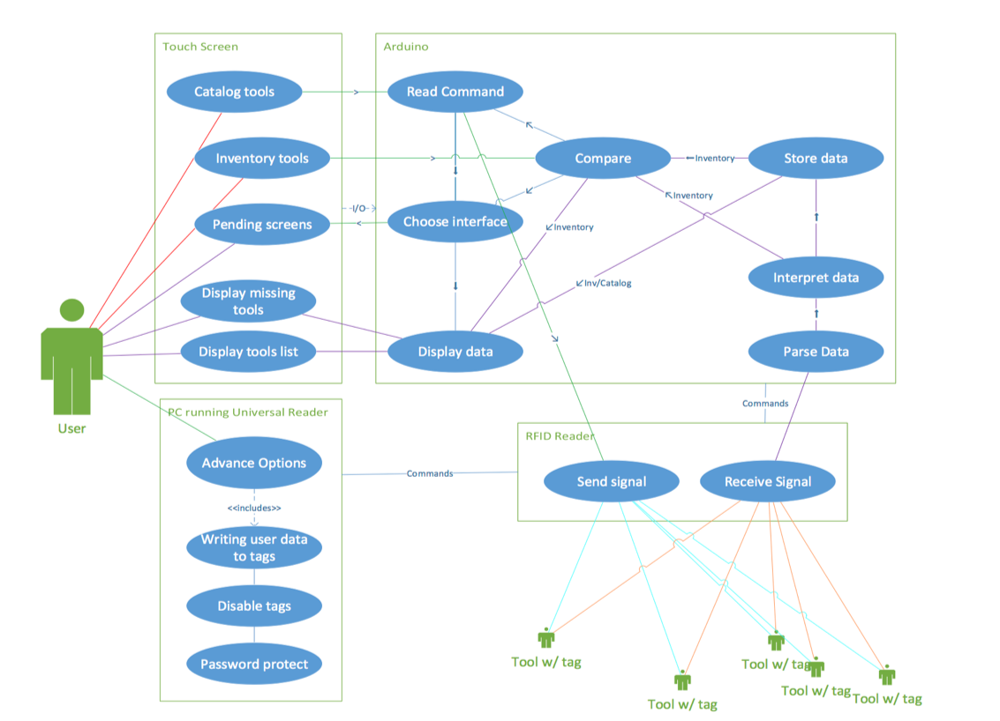
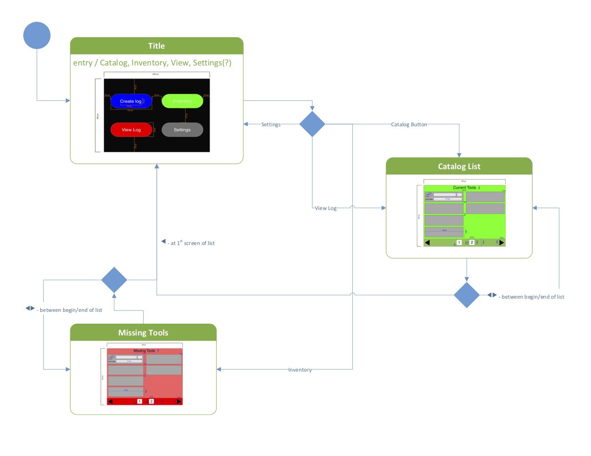

Which led to the following UML to expand upon the retailer provided libraries for each module. 

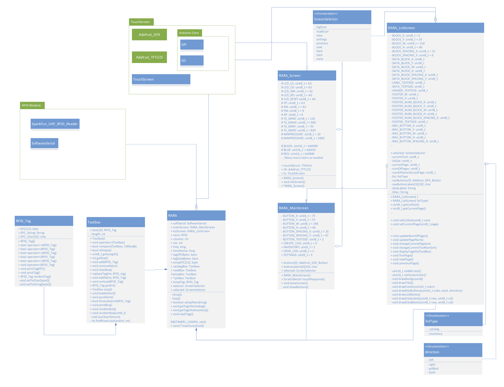

## Results
In the end, the became a simple interface that had a few simple functions.  Writing of the tag's Electronic Product Code (EPC) to a user friendly 12-character string could be accomplished via the serial connection with a computer running [Universal Reader Assistant Program](http://www.thingmagic.com/index.php/manuals-firmware#Universal_Reader_Assistant). Once the tags were customized, the user could use the module independent of the PC to read and inventory tags. The device allowed for fairly consistent readings within a foot of the device. This could be improved on using a better antenna, amplify components, specialized RFID tags. Of course, placement of tags and item composition also played a significant role on whether or not the tag was read. Once powered on the Main Screen came up, with four options. The "Log" button reads the surrounding tags, stores the data, and displays them in a Catalog Screen. The "Check" button reads the surrounding tags and compares them to previously the previously stored catalog. If any tags are unaccounted for they will be displayed in a Missing Screen. Pressing the "View Log" button will display stored catalog info in a Catalog Screen. Finally, the "Clear" button removes all stored data.

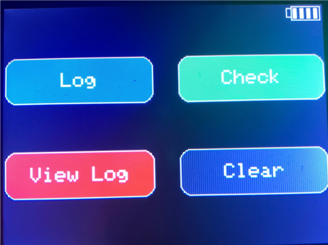
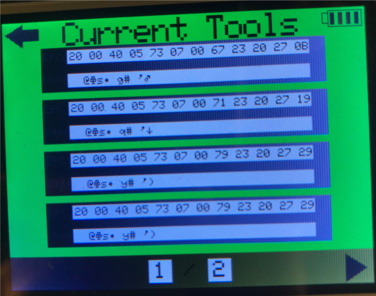
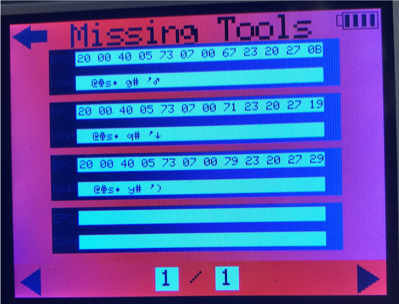
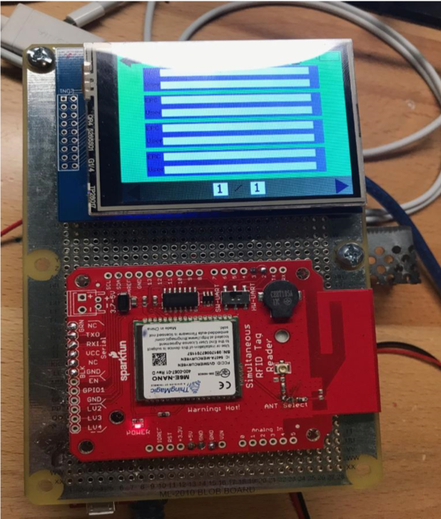
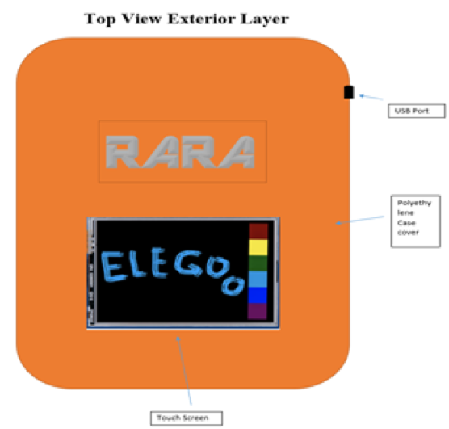
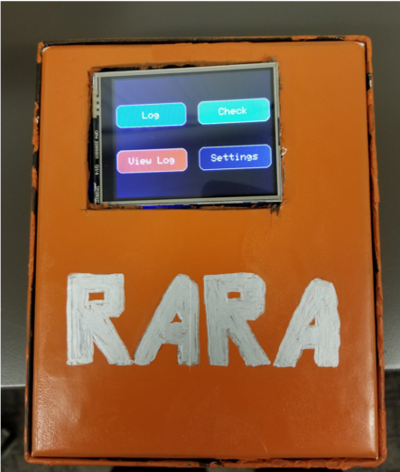

## TODO
- [ ] Mobile Device Control
    - [ ] Bluetooth
    - [ ] WIFI
- [ ] Advanced features without PC
- [ ] Improved antenna
    - [ ] Multi-array
    - [ ] Amplification
- [ ] Sensor based controls
    - [ ] Motion
    - [ ] Magnetic
- [ ] Unit Expansion
    - [ ] Base/Satellite 
    - [ ] Plug and play with multi-tier antenna setups

